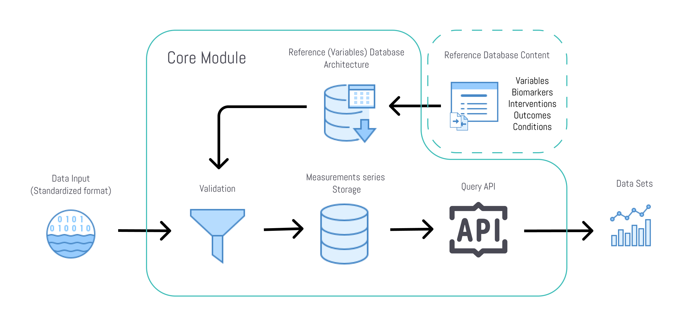

# Health data storage solution basic
Te CureDAO basic health data storage solution let's you store all af your biomedical references and datapoints in a self hosted environment with the full interoperability with the CureDAO ecosystem provided by our Unified Health API. The setup instruction are with the example of using supabase, a opensource managed PostGres Database with Authentication out of the box.

The storage solution consisits of to main tables: The variables tables for the references (Reference Database) and the actual measurements in their table.

## Reference Database
To generate a common language for health data we put all health data references into a single table and call them variables. Pretty much anything quantifying a certain state of a human being could be used as health data and its analysis to find new insights.
Standard health reference databases including units of measurement, biomarkers, medical codes, medications,
side-effects, supplements, foods, ingredients, and more.

The health reference data repository is part of our core module **The Unified Health API (UHA)**, which has the main purpose to provide a single storage and query solution for the analysis of health data.

The variables are:

- Biomarkers (Wearables, Labs, Multiomics)
- Outcomes
- Conditions, Symptoms and Diseases
- Interventions (Medication, Supplements, Therapies)
- Data from Insurance and Healthcare
- Nutritional Intake
- Environment
- Social and Digital markers
- Any other health related data

### How it works

Using **The Unified Health API (UHA)** imported data points will be mapped to a measurement schema, which pulls the reference information from this reference database to validate measurement values and to tag the data with the common identifiers.

Existing reference databases such as LOINC codes, used in healthcare for lab-tests for example, are pulled in together.
Additional information on top of these databases, such as fixed units, synonyms and cross references are necessary for the purpose of more efficient data analysis.
These additions are community maintained and version controlled for an ecosystem wide shared use to create seamless interoperability. 
The magic comes in with completely new entries, where standards are still missing. E.g. new digital biomarkers in development can be easily implemented in an own instance and published as proposal for being added to the commonly used reference.

This storage solution is also applied in applications, where users create their own marker references in a private environment, so that a seamless use of all tools in the infrastructure are still available.

## Variables Schema

[Variables schema documentation](schemas/variables.md)

[Variables schema definition](schemas/variables.sql)

## Measurements Schema

[Measurements schema documentation](schemas/variables.md)

[Measurements schema definition](schemas/variables.sql)

## How to get started

- Visit [supabase.com](https://supabase.com/) and create an account and a project
- Inside your project navigate to the SQL-Editor/New query and paste the [sql-setup.sql](sql-setup.sql) - script (This will create the tables, policies, user management and the API)
- Thats it for the Backend!
- For an example of a browser application frontend (React) using this backend, head over to our [health-reference-browser](https://github.com/curedao/health-reference-online-browser) repo.

Alternatively you can use the [Supabase Quickstart tutorial](https://supabase.com/docs/guides/with-react) for a frontend setup in any of the popular frameworks.

